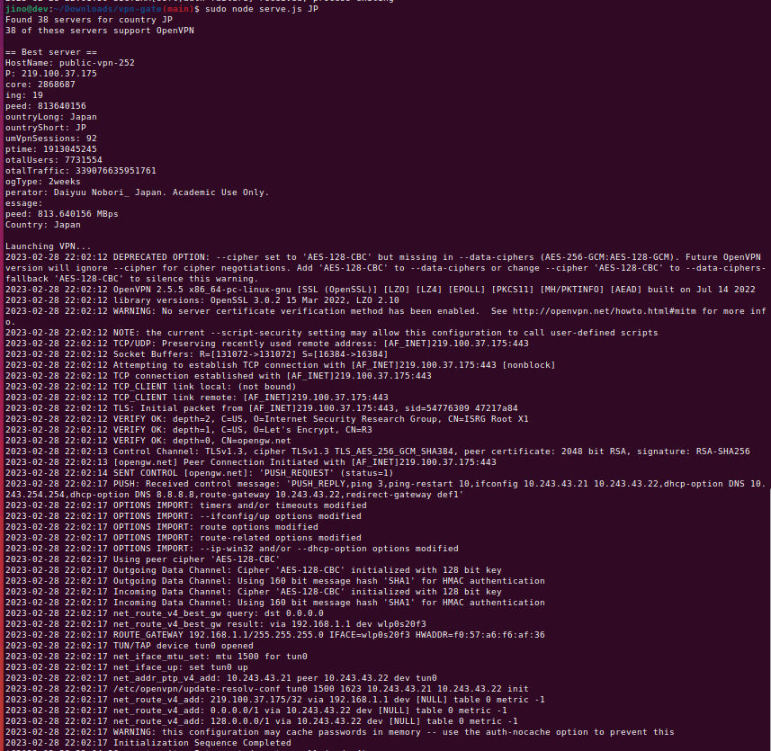
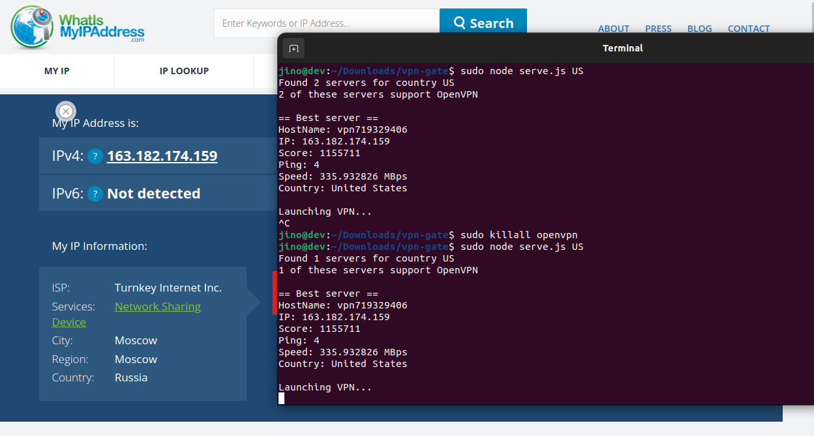

# NodeVPN
This Node.js script is my own reimplementation of an unmaintained obsolute [python 2](https://gist.github.com/Lazza/bbc15561b65c16db8ca8) script. It enables users to easily connect to VPNGate's free VPN service. The script prompts the user to specify their desired output country, and automatically selects the best server for that location. With this script, users can easily connect to VPNGate's VPN service without needing to manually configure any settings or choose a server.

### Requirements
* [Open VPN](https://openvpn.net/)
* Node
* [VPN Gate](http://www.vpngate.net/en/)
* Linux

### Installation
```
npm install
```

### Run the service using country code or country names
```
sudo node serve.js US # or sudo node serve.js "United States"
```
### Demo
* Successfully connected



* IP check



### Disconnect from the server
```
sudo killall openvpn
```

